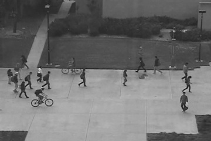
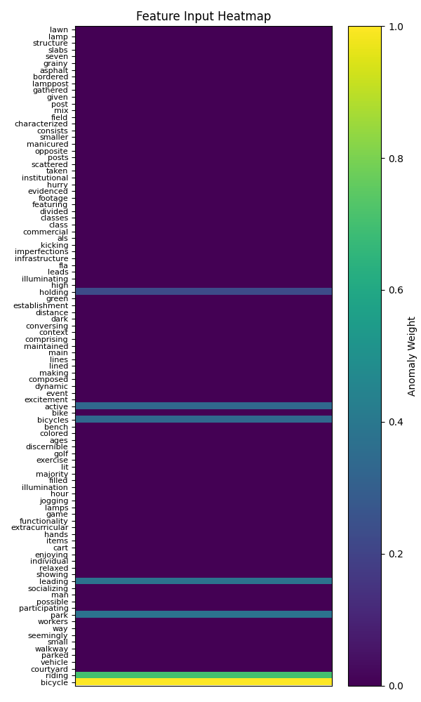

## Dependencies

This project requires Python>=3.12 and the packages listed in `requirements.txt`.

### Creating a Virtual Environment (Recommended)

```bash
conda create -n vadsk python=3.12
conda activate vadsk
pip install -r requirements.txt
```

### Running VADSK

```bash
# Move into source code directory
cd src/

# Generate keywords for the dataset (defaults to ped2)
python induct.py --dataset <ped2|avenue|SHTech>

# Train VADSK classification model (will utilize pre-generated frame descriptions if present)
python deduct.py --train --dataset <ped2|avenue|SHTech>

# Test VADSK classification model (can be ran after training)
python deduct.py --test --dataset <ped2|avenue|SHTech>

# Add interpret flag to view the feature input heatmap and the live flag to run model on each frame independently
python deduct.py --test --interpret --live
```

### Example Inference

#### Input frame



#### Generated description

*The image shows a black and white scene of a concrete plaza with several people and objects present. In the foreground, there are approximately 14 people walking and running around the plaza. Some are carrying backpacks, while others are holding bicycles. One person is riding a bicycle, and one is pushing another one. In the background, there is a grassy area with bushes and trees, as well as a building with a sidewalk leading to it. The overall atmosphere suggests a busy and active area, possibly a university campus or a public park.*

#### Classification input (using generated keyword weights)



#### Classification output

**99.01%** chance this frame is an anomaly.